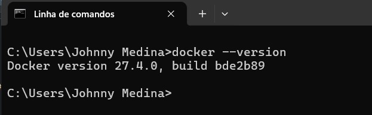
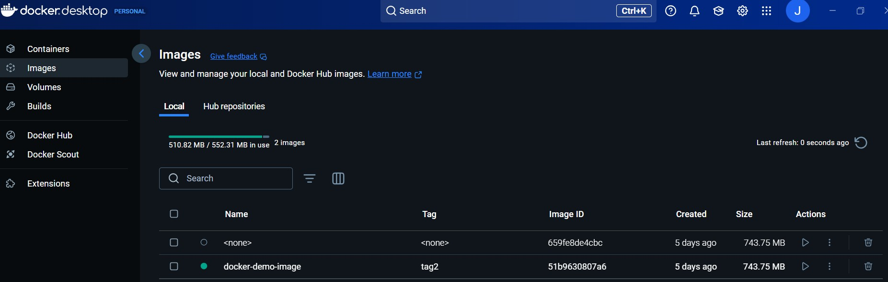
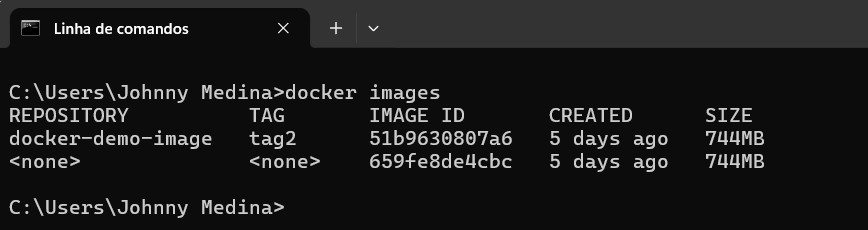
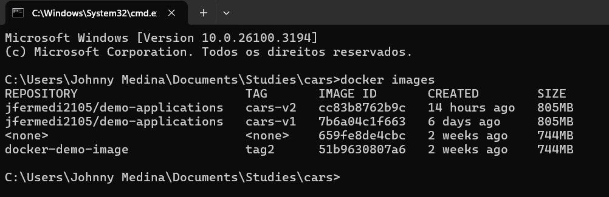
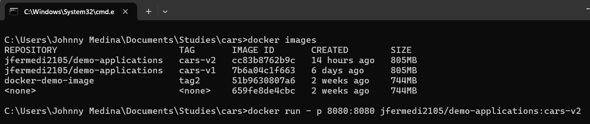

# Cars-api
This is a Rest API for managing cars information, contains the creation, retrieve, updating all information or partially and deleting information. 
It uses **Spring Boot** and **Spring Data with Hibernate** to establish connection with an **H2 in-memory database** for rapid development and testing. Apart from that, a microservice approach was done for the service level of this project, Docker to enable the possibility to create a "image" of the application and run it on a container,  also contains **Junit5 and Mockito** for test coverage purposes

## Features
- Create a new car information based on the brand and version on the incoming request. Persist the information of new car in the database.
- Retrieve all cars information that exists in the database.
- Retrieve a specific car information based on the id of the car.
- Retrieve a list of cars information based on the brand of the car, assuming that could exist more than one car with the same brand in the database.
- Retrieve a list of cars information based on the version of the car, assuming that could exist more than one car with the same version in the database.
- Delete the car information based on the id of the car.
- Delete all the cars information that exists in the database.
- Update all information of a car based on the id of the car with the incoming data of the request.
- Update partially the car information based on the id of the car with the incoming data of the request.

## Technologies Used

- **Java 17**: Programming language
- **Spring Boot**: Back-end framework.
- **Spring Data JPA with Hibernate**: For database interaction.
- **H2 Database**: In-memory database for runtime and testing execution.
- **Postman**: For testing the API endpoints.
- **Docker**: For creating a image of the application.
- **Junit5 and Mockito**: For test coverage of the application.

## Pre-requisites

To run this project, you'll need: 
- Java 17 or later
- Maven (for dependency management)
- Postman (for testing the API endpoints using collections)
- Git (for cloning the project files and resources)
- Docker Desktop (Optional, and needed only for running the image of the application)

## Instalation and Setup

1. Clone the repository:
   ```bash
   git clone https://github.com/jfermedi/cars-api
   cd your-repo-name

2. Configure the database connection(optional):

    By default this project uses the in-memory H2 database.
   All the setup for the database is located in the **src/main/java/resources/application.yaml**

3. Build and run the project:
   
   The build is needed only for the first time you're setting up the project on your local environment. Simply do a *mvn build* , or if you want to add any other dependency, remember to add it on the pom.xml and execute the build again.
   To run this project it can be done by going to the SpringBoot main method (located in the **src/main/java/com/api/cars/cars_api/CarsApiApplication.java**) and run as a **SpringBoot Application**.

4. Access the API:

- **Base URL**: http://localhost:8080/cars
- **H2 Console**: http://localhost:8080/h2-console
- Use JDBC URL: jdbc:h2:mem:cars-db
- Username: root
- Password: root

## API Endpoints

| HTTP Method | Endpoint                      | Description                           | Request Parameters                     | Response Example                  |
|-------------|-------------------------------|---------------------------------------|----------------------------------------|-----------------------------------|
| `GET`       | `/cars/all`     | Retrieve all cars information | None                                  | `"cars": [{"carId": 1,"brand": "RENAULT","price": "22.0","version": "PICKUP"},{"carId": 2,"brand": "MERCEDES","price": "50.0","version": "SPORT"}, {"carId": 3,"brand": "BMW","price": "45.0","version": "SUV"}...]` |
| `GET`       | `/cars/{carId}`     | Retrieve a specific car information based on carId | `carId` (String) | `"car": {"carId": 1,"brand": "RENAULT","price": "22.0","version": "PICKUP"}` |
| `GET`        | `/cars/brand/{carBrand}`   | Retrieve all cars information based on carBrand | `carBrand` (String) | `["cars": [{"carId": 1,"brand": "RENAULT","price": "22.0","version": "PICKUP"}, {"carId": 2,"brand": "RENAULT","price": "50.0","version": "SPORT"} ...]` |
| `GET`        | `/cars/version/{carVersion}`   | Retrieve all cars information based on carVersion | `carVersion` (String) | `["cars": [{"carId": 1,"brand": "RENAULT","price": "22.0","version": "PICKUP"}, {"carId": 2,"brand": "MERCEDES","price": "50.0","version": "PICKUP"} ...]` |
| `POST`       | `/cars/createCar/{carBrand}/{carVersion}`   | Creates a new car an save it on database | `carBrand`, "7" (String), `carVersion` ,"5" (String) | `"car : {"carId:" 4, "brand": "FIAT", "price": 25.0, "version": "PICKUP"}"` |
| `DELETE`     | `cars/deleteCar/{carId}` | Deletes a car information based on carId | `carId` (String) | `Car deleted with success` |
| `DELETE`     | `cars/deleteAllCars` | Deletes all cars information  | None | `All cars deleted with success` |
| `PUT`        | `cars/updateCar/{carId}` | Updates a car information based on carId |   `carId` (String), `carToUpdate` (Cars) `{"brand": "1","version": "5"}` | `"car": {"carId": 5, "brand": "OPEL", "price": 18.0, "version": "SUV"}` |
| `PATCH`      | `cars/updateCarPart/{carId}` | Updates partially a car information based on carId | `carId` (String), `dataToUpdate` (Map<String, Object>) `"version": "3"` | `"car": {"carId": 5, "brand": "OPEL", "price": 18.0, "version": "SPORT" }` |

5. Docker setup (Optional):
 Go to official docker page (https://docs.docker.com/get-started/get-docker/) and install Docker Desktop according to your system (Windows, Mac or Linux).
  Once the installation it's done , you can open the **cmd** in your system and type the following command to check the version installed : 
  `` docker --version `` .<br>
  <br>
  5.1:  In order to be able to pull the image of this application, we need to use **docker commands** directly in the **cmd**. There're a lot of docker commands that can be used, but in this guide we'll focus only on the **docker pull** and **docker run** commands. 
 The first command we need to use is the **docker pull** to pull the image of the application to our local environmet. The proccess of pulling a docker image is simple, but the syntax need to be followed correctly.  <br>
  5.2 Open the docker desktop: First, ensure you've the docker desktop up and running in order to be able to execute the docker commands directly on your local environment. Apart from that, the docker desktop provides a UI more friendly to check the containers and images running.<br>
  <br>
  5.3 Open the **cmd** in your project location and, use the following command to check the docker images running in your environment : `` docker images `` <br>
  <br>
  5.4 To pull a docker image you need to access the **dockerhub** and search for the repository and image inside of it that you want to pull. For this application you can enter the following docker command to pull the image : `` docker pull jfermedi2105/demo-applications:cars-v2``<br>
  5.5  After pulling successfully the docker image, you can type the `` docker images `` command to check the new image that had been pulled<br>
  <br>
  5.6 Running the application: <br>
  After pulling the image we're able to run the application by simply enter the docker command `` docker run image -p <port:port> <image-name:tag>``, and we'll be able to see the application starting in the cmd <br>
   <br>
  If we go to the postman and try to call the endpoints, we'll be able to execute the application<br>
  5.7 Stopping the application:<br> To stop the application in the cmd just type `` ctrl + c `` or go to the docker desktop and stop the image that it's running
   
